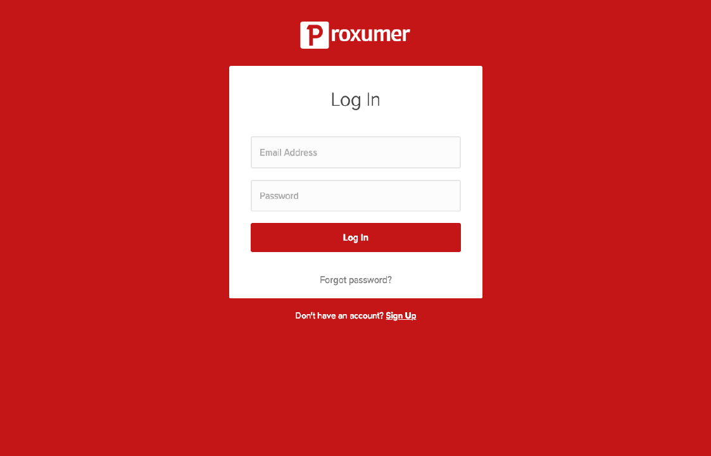
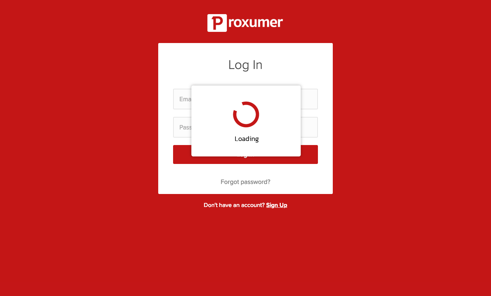
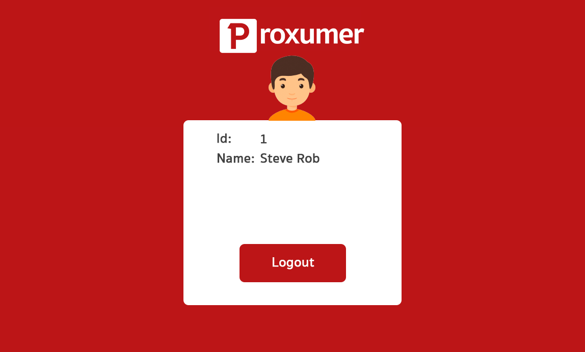

# Proxumer Frontend Exam

## require

- Node version 8+

## Installation

```
$ npm install
```

## Build Login Page



## Running API Service

```
$ npm run start:server
```

## API Response

empty username and password

```json
{
  "errorCode": 400,
  "message": "username or password can not be empty"
}
```

invalid username or password

```json
{
  "errorCode": 401,
  "message": "invalid username or password"
}
```

login success

```json
{
  "errorCode": 200,
  "user": {
    "id": 1,
    "name": "Steve Rob."
  }
}
```

- สร้างหน้า เข้าสู่ระบบโดยอิงจากตาม design ที่ให้ไว้ในรูป ดูเพิ่มเติมที่ folder screenshots/

## Username ที่ถุกต้อง

- username: frontend@proxumer.com
- password: 123456

## Login Step

- กด Login Button
- แสดง Loading Modal รอระหว่างการส่ง request api



ในกรณีเข้าสู่ระบบไม่สำเร็จ ให้แสดง Error Modal(ออกแบบตามใจชอบ) แล้วนำ error message ที่ได้จาก server มาแสดง

กรณีที่เข้าสู่ระบบสำเร็จจะปิดในส่วนของการแสดงผล Login ทั้งหมด เปลี่ยนเป็นหน้ายินดีต้อนรับเข้าสู่ระบบแทน หากกด Logout จะไปสู่ step ของการเข้าสู่ระบบอีกครั้ง


## Color Code

- red #c41717

## Bonus

- หากใช้ Hooks จะได้รับคะแนนพิเศษ
- หากเขียน Unit Test Component จะได้รับคะแนนพิเศษ
